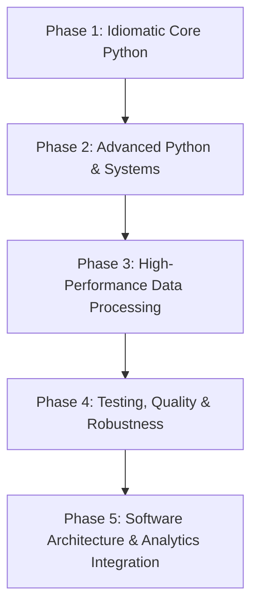

# Python Expertise Roadmap: Analytics & Data Engineering Edition

This roadmap is designed to guide you from foundational Python to expert-level mastery, with a special emphasis on software engineering practices, performance optimization, and data architectures.

---

## 🗺️ Path to Python Mastery at a Glance

---

## 📂 Phase 1: Idiomatic Core Python (Writing "Pythonic" Code)
Before diving into complex structures, master the philosophy and conventions of Python (PEP 8).

### Key Topics
* **Control Flows & Comprehensions**: Dict, list, and set comprehensions (with nested loops and conditionals).
* **Built-in Data Structures**: Deep understanding of `dict`, `list`, `set`, and `tuple` (mutability, hashing, and time complexity of operations).
* **The Collections Module**: Utilizing `defaultdict`, `Counter`, `NamedTuple`, and `deque` for cleaner code.
* **Error & Exception Handling**: Custom exceptions, try-except-else-finally blocks.
* **File & Path I/O**: Modern path manipulation using `pathlib`.

### Practical Milestone
> [!TIP]
> Rewrite your helper scripts (e.g., [multiply.py](file:///Users/harishakarapu/Desktop/py_learn/multiply.py)) using proper Python packaging structure, argument parsing (`argparse`), and clean exception handling.

---

## ⚙️ Phase 2: Advanced Python & Systems
Learn how Python works under the hood and how to leverage its powerful runtime features.

### Key Topics
* **Iterators & Generators**: `yield`, generator expressions, memory efficiency with large streams of data.
* **Decorators**: Function and class decorators, passing arguments to decorators, maintaining metadata with `@functools.wraps`.
* **Context Managers**: Implementing custom context managers using both class-based (`__enter__`/`__exit__`) and generator-based (`@contextmanager`) approaches.
* **Object-Oriented Programming (OOP) & Dunder Methods**: Understanding the object lifecycle, `__init__` vs `__new__`, descriptor protocols, and magic methods for custom container classes.
* **Functional Programming**: High-order functions, `map`, `filter`, and functions in the `itertools` and `functools` libraries.

---

## ⚡ Phase 3: High-Performance Data Processing
As a professional working with data, standard loops are often a bottleneck. Learn to write fast, vectorized, and memory-efficient data pipelines.

### Key Topics
* **Vectorization & Memory Layouts**: Understanding C-contiguous layouts, pandas vs. Polars (Apache Arrow memory model).
* **Dataframes at Scale**:
  * **Pandas**: Optimization techniques (avoiding `.iterrows()`, using `.apply()` vs vectorization, memory downcasting).
  * **Polars / PyArrow**: Lazy evaluation, column expressions, parallel execution engines, and zero-copy memory sharing.
* **Database & Warehouse Integration**: Efficient batch loading, streaming inserts, and executing parameterized queries with packages like `psycopg2`, `adbc`, or cloud warehouse SDKs.

---

## 🧪 Phase 4: Testing, Quality & Robustness
Expert code is reliable, testable, and self-documenting.

### Key Topics
* **Modern Testing with Pytest**: Fixtures, parameterization, mocking external database connections, and unit vs. integration testing.
* **Static Typing**: Leveraging type hinting with `typing` / `types`, and running static checkers like `mypy` or `pyright`.
* **Data Quality Assertions**: Integrating frameworks like `pydantic` or `pandera` to validate schemas and data distributions at runtime.
* **CI/CD Integration**: Pre-commit hooks for formatters (`black` / `ruff`) and linters to maintain style standards automatically.

---

## 🏛️ Phase 5: Software Architecture & Analytics Integration
Bring software engineering patterns to the analytics stack.

### Key Topics
* **Config-Driven Architecture**: Designing pipeline configs using YAML/JSON and compiling them dynamically.
* **Concurrency & Parallelism**:
  * Threading vs. Multiprocessing (understanding the GIL).
  * Asynchronous programming (`asyncio`) for network-bound tasks (e.g., parallel API calls).
* **Advanced Integration**:
  * Writing Custom dbt Python Models.
  * Building production CLI tools using libraries like `click` or `typer`.
  * Building internal packages (structuring `pyproject.toml`, writing setup scripts).
